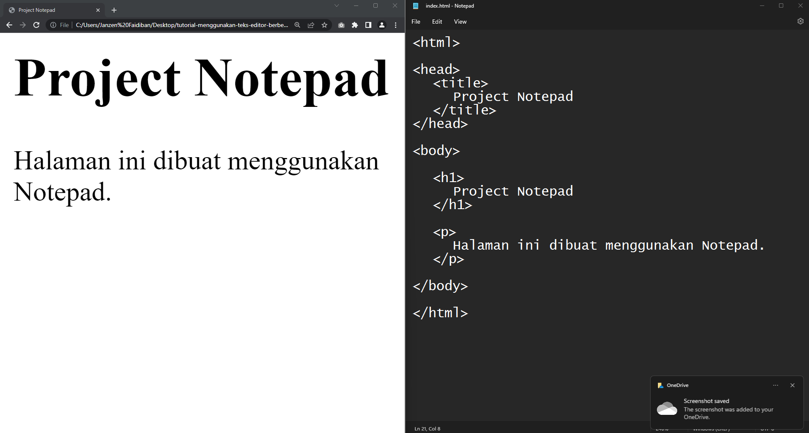
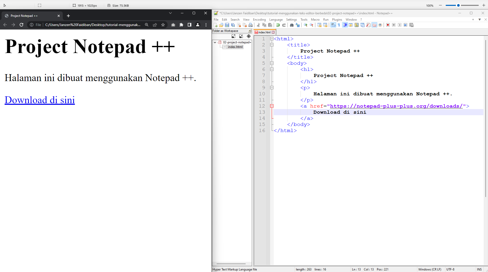
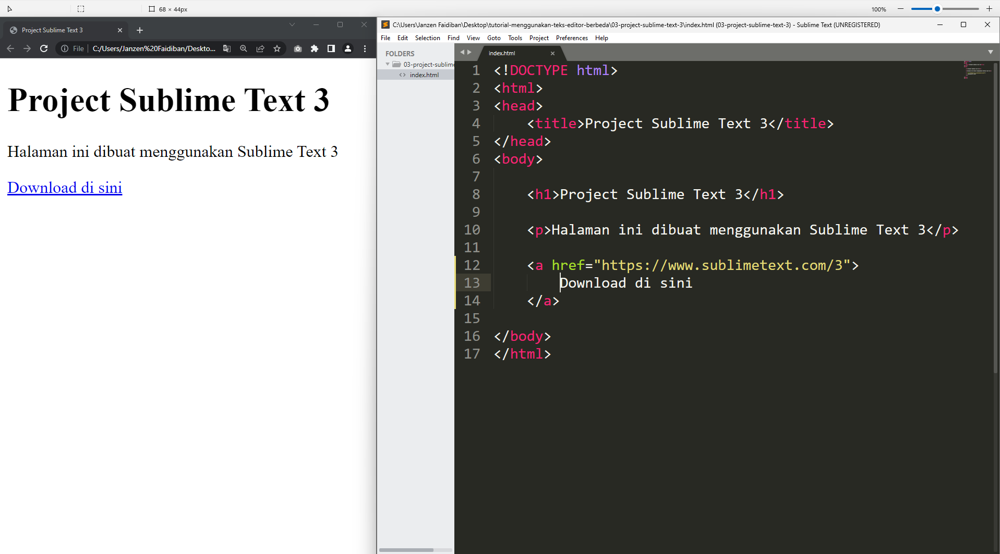
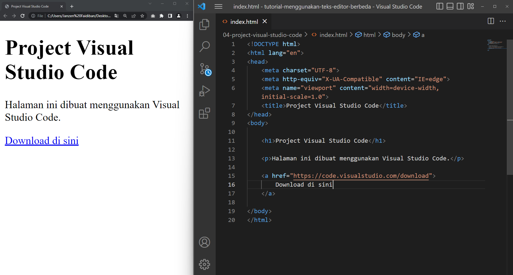

# 📚 Menulis HTML Menggunakan Teks Editor Berbeda

## Notepad

Notepad merupakan teks editor bawahan dari Windows.

## Notepad++

Notepad++ merupakan teks editor yang mirip seperti Notepad tetapi memiliki  vitur tambahan. Teks editor ini dibuat untuk mendukung developer / programmer menulis programming codes.

Download di sini https://notepad-plus-plus.org/downloads/

## Sublime Text 3

Sublime Text 3 merupakan salah satu teks editor yang dibuat khusus untuk menulis programming codes, serupa dengan Notepad ++.

Download di sini https://www.sublimetext.com/3

## Visual Studio Code

Visual Studio Code merupakan juga merupakan teks editor yang dibuat khusus untuk menulis programming codes.

Download di sini https://code.visualstudio.com/download

